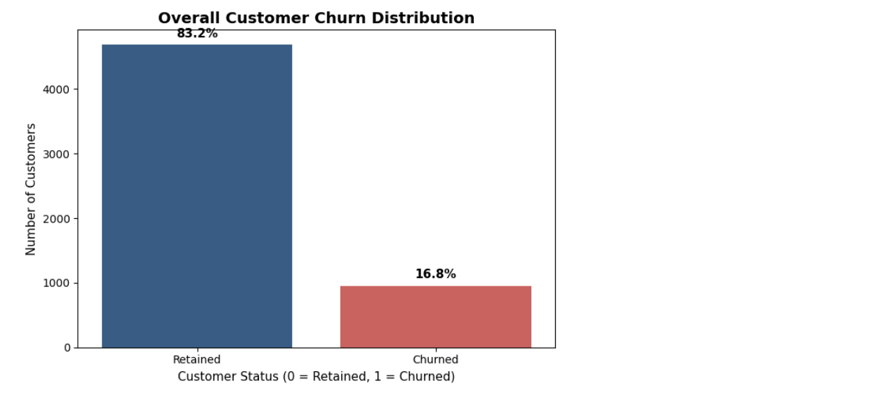
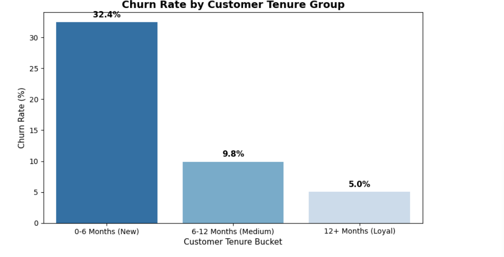
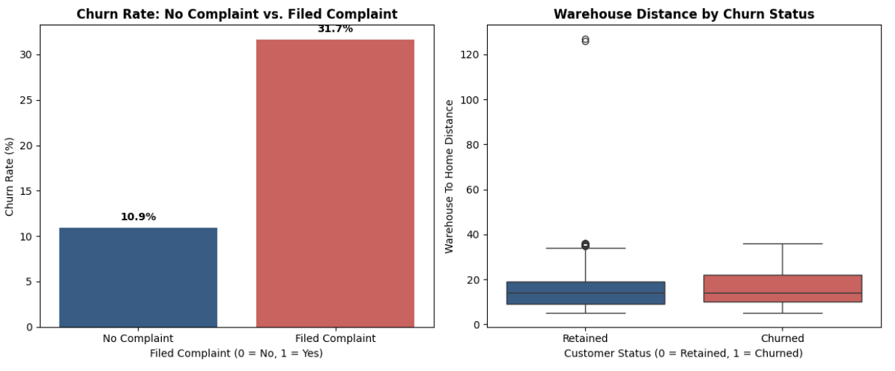
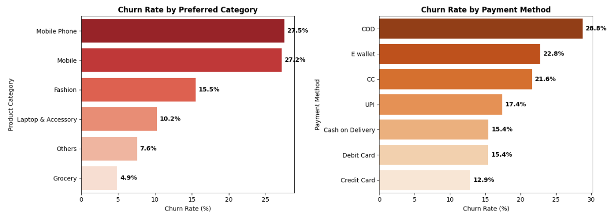
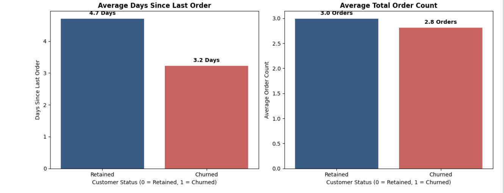

# 🛒 E-Commerce Customer Churn Analysis & Retention Strategy

## 📌 Executive Summary
Customer churn poses a direct threat to e-commerce profitability and customer lifetime value (CLV). This project analyzes **5,600+ customer records** using Python to identify the primary drivers of customer attrition and provide actionable, executive-level retention strategies.

### Key Business Insights:
* **Baseline Churn:** Overall churn rate sits at **16.8%**, establishing a baseline revenue loss metric.
* **Early Tenure Risk:** New customers (0–6 months) churn at **32.4%**, which is over 6x higher than loyal users (5.0%).
* **Service Friction:** Customers who file a complaint churn at **31.7%** vs. **10.9%** for non-complainers[cite: 3].
* **Category & Payment Vulnerability:** High-ticket Mobile/Laptop orders and Cash-on-Delivery (COD) experience severe churn rates (~27.5%)[cite: 4].
* **Order Threshold:** Average orders for retained users sit at **3.3 orders** vs **2.8 orders** for churned users, highlighting a critical 3rd-order retention milestone.

---

## 🛠️ Tech Stack & Skills
* **Language:** Python 3.x
* **Libraries:** Pandas, NumPy, Matplotlib, Seaborn
* **Environment:** Jupyter Notebook
* **Key Analytical Skills:** Data Cleansing & Median Imputation, Exploratory Data Analysis (EDA), Risk Cohort Segmentation, Strategic Insight Generation

---

## 📊 Exploratory Data Analysis & Visualizations

### 1. Overall Customer Churn Distribution

* Establishes the 16.8% baseline churn metric across the customer base.

### 2. Customer Tenure Vulnerability (0–6 Months)

* Demonstrates that drop-off is heavily concentrated during the initial onboarding window.

### 3. Customer Service & Fulfillment Distance Friction

* Unresolved complaints triple customer churn probability, while longer warehouse distances introduce operational friction[cite: 3].

### 4. Category & Payment Friction Analysis

* High-value tech product orders and non-prepaid payment options show the highest customer attrition[cite: 4].

### 5. Recency & Engagement Patterns

* Highlights the rapid drop-off in user engagement and confirms the 3rd-order retention threshold.

---

## 💡 Strategic Business Recommendations
1. **90-Day VIP Onboarding Program:** Implement structured re-engagement discounts and welcome guides during the first 0–6 months to mitigate the 32.4% early churn rate.
2. **Priority Service Resolution:** Route tickets from complaining customers to an expedited support queue with automated delivery coupons to mitigate complaint-driven churn[cite: 3].
3. **Prepaid Checkout Incentives:** Introduce cashbacks and seamless auto-refund policies for COD orders to reduce checkout drop-off in high-risk categories like Mobile Phones and Laptops[cite: 4].
